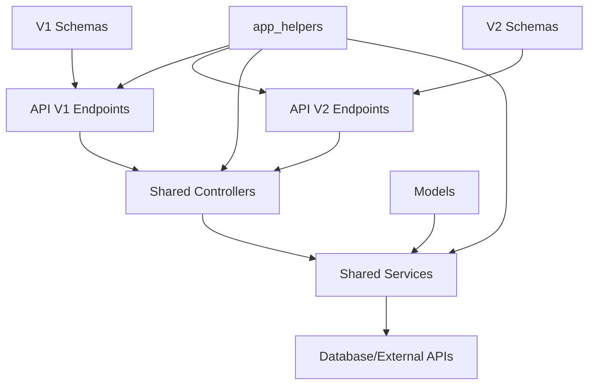

# API Architecture Restructure Design Document

## Overview

This design document outlines the restructuring of the current API architecture from a monolithic endpoint structure to a clean, layered architecture with proper separation of concerns and robust API versioning support. The new architecture implements a Controller-Services pattern with version-specific schemas, providing better maintainability, testability, code organization, and seamless API evolution.

The restructure transforms the current structure where business logic is mixed with HTTP handling into a clean layered approach where each layer has distinct responsibilities, and API versioning is handled at the routing and schema level only.

## Architecture

### Current vs. New Architecture

#### Current Structure

```
api/v1/users/post.py (contains everything)
├── HTTP handling
├── Request validation
├── Business logic
├── Database operations
└── Response formatting
```

#### New Structure (Fixed Versioning)

```
# Version-agnostic business logic
users/
├── controller.py   (Shared across all API versions)
└── services.py     (Shared across all API versions)

# Version-specific routing and schemas
api/
├── schemas/
│   ├── v1/users.py    (V1-specific request/response models)
│   └── v2/users.py    (V2-specific request/response models)
├── v1/users.py        (V1 routes → shared controllers)
└── v2/users.py        (V2 routes → shared controllers)
```

### Layered Architecture Pattern with Proper Versioning



### Layer Responsibilities

#### API Layer (api/v1/, api/v2/)

- **Purpose**: Version-specific route definition and HTTP method handling
- **Responsibilities**:
  - Define version-specific FastAPI routes and HTTP methods
  - Handle dependency injection (database sessions, authentication)
  - Use version-specific schemas for request/response validation
  - Delegate immediately to shared, version-agnostic controllers
  - Maintain RESTful URL patterns within each version

#### Controller Layer (resource packages/) - VERSION AGNOSTIC

- **Purpose**: HTTP request processing and business logic orchestration shared across all API versions
- **Responsibilities**:
  - Handle HTTP request/response processing for any API version
  - Accept parameters from any API version gracefully
  - Implement business logic workflows
  - Coordinate multiple service calls
  - Handle authentication and authorization
  - Format responses using response helpers
  - Apply business rules and validation
  - Manage transaction boundaries

#### Services Layer (services.py in each resource/) - VERSION AGNOSTIC

- **Purpose**: Data access and core business logic shared across all API versions
- **Responsibilities**:
  - Handle database operations
  - Implement core business logic
  - Manage entity lifecycle
  - Handle external API integrations
  - Provide data transformation
  - Execute database queries and transactions

## Components and Interfaces

### Directory Structure (Improved Versioning)

```
app/
├── api/
│   ├── schemas/                    # Version-specific schemas
│   │   ├── __init__.py
│   │   ├── v1/
│   │   │   ├── __init__.py
│   │   │   ├── users.py           # V1 request/response models
│   │   │   ├── pets.py
│   │   │   └── appointments.py
│   │   └── v2/
│   │       ├── __init__.py
│   │       ├── users.py           # V2 request/response models
│   │       ├── pets.py
│   │       └── appointments.py
│   ├── v1/
│   │   ├── __init__.py
│   │   ├── users.py               # V1 routes → shared controllers
│   │   ├── pets.py
│   │   └── appointments.py
│   └── v2/
│       ├── __init__.py
│       ├── users.py               # V2 routes → shared controllers
│       ├── pets.py
│       └── appointments.py
├── users/                          # Version-agnostic business logic
│   ├── __init__.py
│   ├── controller.py              # Shared across ALL API versions
│   └── services.py                # Shared across ALL API versions
├── pets/
│   ├── __init__.py
│   ├── controller.py
│   └── services.py
├── appointments/
│   ├── __init__.py
│   ├── controller.py
│   └── services.py
├── app_helpers/
│   ├── __init__.py
│   ├── auth_helpers.py            # Authentication utilities
│   ├── response_helpers.py        # Response formatting
│   ├── validation_helpers.py      # Common validation
│   └── dependency_helpers.py      # Dependency injection utilities
└── app_tests/
    ├── __init__.py
    ├── unit/                      # Unit tests for individual functions
    │   ├── __init__.py
    │   ├── test_controllers/
    │   ├── test_services/
    │   └── test_schemas/
    ├── functional/                # Functional tests for complete workflows
    │   ├── __init__.py
    │   ├── test_user_workflows/
    │   ├── test_pet_workflows/
    │   └── test_appointment_workflows/
    └── integration/               # Integration tests for full API flows
        ├── __init__.py
        ├── test_v1_endpoints/     # V1 API integration tests
        ├── test_v2_endpoints/     # V2 API integration tests
        └── test_version_compatibility/
```

### Version-Specific Schema Definitions

#### V1 Schemas (api/schemas/v1/users.py)

```python
from pydantic import BaseModel, EmailStr
from typing import Optional
from datetime import datetime

class UserCreateV1(BaseModel):
    """V1 user creation schema - basic fields only."""
    email: EmailStr
    first_name: str
    last_name: str
    phone_number: Optional[str] = None

class UserResponseV1(BaseModel):
    """V1 user response schema - basic fields only."""
    id: str
    email: str
    first_name: str
    last_name: str
    phone_number: Optional[str]
    is_active: bool
    created_at: datetime

    class Config:
        from_attributes = True

class UserUpdateV1(BaseModel):
    """V1 user update schema."""
    first_name: Optional[str] = None
    last_name: Optional[str] = None
    phone_number: Optional[str] = None
```

#### V2 Schemas (api/schemas/v2/users.py)

```python
from pydantic import BaseModel, EmailStr
from typing import Optional, Dict, List
from datetime import datetime
from enum import Enum

class UserRole(str, Enum):
    ADMIN = "admin"
    VETERINARIAN = "veterinarian"
    RECEPTIONIST = "receptionist"
    PET_OWNER = "pet_owner"

class UserCreateV2(BaseModel):
    """V2 user creation schema - enhanced with roles and preferences."""
    email: EmailStr
    first_name: str
    last_name: str
    phone_number: Optional[str] = None
    role: UserRole = UserRole.PET_OWNER  # New in V2
    department: Optional[str] = None      # New in V2
    preferences: Optional[Dict] = None    # New in V2
    notification_settings: Optional[Dict] = None  # New in V2

class UserResponseV2(BaseModel):
    """V2 user response schema - enhanced fields."""
    id: str
    email: str
    first_name: str
    last_name: str
    phone_number: Optional[str]
    role: UserRole
    department: Optional[str]
    preferences: Optional[Dict]
    notification_settings: Optional[Dict]
    is_active: bool
    created_at: datetime
    last_login: Optional[datetime]        # New in V2
    permissions: List[str]                # New in V2

    class Config:
        from_attributes = True

class UserUpdateV2(BaseModel):
    """V2 user update schema - enhanced fields."""
    first_name: Optional[str] = None
    last_name: Optional[str] = None
    phone_number: Optional[str] = None
    role: Optional[UserRole] = None
    department: Optional[str] = None
    preferences: Optional[Dict] = None
    notification_settings: Optional[Dict] = None
```

### Version-Agnostic Controller Implementation

```python
# users/controller.py - SHARED ACROSS ALL API VERSIONS
from typing import List, Optional, Union, Dict, Any
from fastapi import Depends, HTTPException, status
from sqlalchemy.ext.asyncio import AsyncSession

from app.core.database import get_db
from app.models import User
from app.api.schemas.v1.users import UserCreateV1, UserResponseV1, UserUpdateV1
from app.api.schemas.v2.users import UserCreateV2, UserResponseV2, UserUpdateV2
from app.app_helpers import get_current_user, require_role, validate_pagination_params
from app.app_helpers import success_response, created_response, paginated_response
from .services import UserService

class UserController:
    """Version-agnostic controller for user-related operations."""

    def __init__(self, db: AsyncSession = Depends(get_db)):
        self.service = UserService(db)
        self.db = db

    async def list_users(
        self,
        page: int = 1,
        size: int = 20,
        search: Optional[str] = None,
        role: Optional[str] = None,
        department: Optional[str] = None,  # V2 parameter, ignored by V1
        is_active: Optional[bool] = None,
        **kwargs  # Handle any additional parameters from future versions
    ) -> Dict[str, Any]:
        """Handle user listing for all API versions."""
        # Validate pagination
        page, size = validate_pagination_params(page, size)

        # Apply business rules for filtering (works for all versions)
        role_enum = None
        if role:
            try:
                from app.api.schemas.v2.users import UserRole
                role_enum = UserRole(role)
            except (ValueError, ImportError):
                # Handle gracefully for V1 or invalid roles
                pass

        # Delegate to service
        users, total = await self.service.list_users(
            page=page, size=size, search=search, role=role_enum, 
            department=department, is_active=is_active
        )

        # Return raw data - let the API layer format for specific version
        return {
            "users": users,
            "total": total,
            "page": page,
            "size": size
        }

    async def create_user(
        self,
        user_data: Union[UserCreateV1, UserCreateV2]
    ) -> User:
        """Handle user creation for all API versions."""
        # Extract common fields present in all versions
        create_params = {
            "email": user_data.email,
            "first_name": user_data.first_name,
            "last_name": user_data.last_name,
        }
        
        # Handle optional fields present in all versions
        if hasattr(user_data, 'phone_number'):
            create_params["phone_number"] = user_data.phone_number
        
        # Handle version-specific fields (V2+)
        if hasattr(user_data, 'role'):
            create_params["role"] = user_data.role
        if hasattr(user_data, 'department'):
            create_params["department"] = user_data.department
        if hasattr(user_data, 'preferences'):
            create_params["preferences"] = user_data.preferences
        if hasattr(user_data, 'notification_settings'):
            create_params["notification_settings"] = user_data.notification_settings

        # Business rule: Validate email uniqueness
        existing_user = await self.service.get_user_by_email(user_data.email)
        if existing_user:
            raise HTTPException(
                status_code=status.HTTP_422_UNPROCESSABLE_ENTITY,
                detail="Email already registered"
            )

        # Delegate to service
        return await self.service.create_user(**create_params)

    async def get_user(self, user_id: str) -> User:
        """Handle user retrieval for all API versions."""
        user = await self.service.get_user_by_id(user_id)
        if not user:
            raise HTTPException(
                status_code=status.HTTP_404_NOT_FOUND,
                detail="User not found"
            )
        return user

    async def update_user(
        self,
        user_id: str,
        user_data: Union[UserUpdateV1, UserUpdateV2]
    ) -> User:
        """Handle user updates for all API versions."""
        # Extract update parameters dynamically
        update_params = {}
        for field, value in user_data.dict(exclude_unset=True).items():
            if value is not None:
                update_params[field] = value

        return await self.service.update_user(user_id, **update_params)
```

### API Layer Implementation by Version

#### V1 API (api/v1/users.py)

```python
from fastapi import APIRouter, Depends
from typing import Optional

from app.users.controller import UserController
from app.api.schemas.v1.users import UserCreateV1, UserResponseV1, UserUpdateV1
from app.app_helpers.dependency_helpers import get_controller
from app.app_helpers.response_helpers import success_response, created_response, paginated_response

router = APIRouter(prefix="/users", tags=["users-v1"])


@router.get("/", response_model=dict)
async def list_users_v1(
        page: int = 1,
        size: int = 20,
        search: Optional[str] = None,
        is_active: Optional[bool] = None,
        controller: UserController = get_controller(UserController)
):
  """V1: List users with basic filtering."""
  result = await controller.list_users(
    page=page, size=size, search=search, is_active=is_active
  )

  # Format response with V1 schema
  return paginated_response(
    data=[UserResponseV1.from_orm(user).dict() for user in result["users"]],
    total=result["total"],
    page=result["page"],
    size=result["size"],
    message="Users retrieved successfully"
  )


@router.post("/", response_model=dict)
async def create_user_v1(
        user_data: UserCreateV1,
        controller: UserController = get_controller(UserController)
):
  """V1: Create user with basic fields."""
  user = await controller.create_user(user_data)
  return created_response(
    data=UserResponseV1.from_orm(user).dict(),
    message="User created successfully"
  )


@router.get("/{user_id}", response_model=dict)
async def get_user_v1(
        user_id: str,
        controller: UserController = get_controller(UserController)
):
  """V1: Get user by ID."""
  user = await controller.get_user(user_id)
  return success_response(
    data=UserResponseV1.from_orm(user).dict(),
    message="User retrieved successfully"
  )


@router.put("/{user_id}", response_model=dict)
async def update_user_v1(
        user_id: str,
        user_data: UserUpdateV1,
        controller: UserController = get_controller(UserController)
):
  """V1: Update user with basic fields."""
  user = await controller.update_user(user_id, user_data)
  return success_response(
    data=UserResponseV1.from_orm(user).dict(),
    message="User updated successfully"
  )
```

#### V2 API (api/v2/users.py)

```python
from fastapi import APIRouter, Depends
from typing import Optional

from app.users.controller import UserController  # Same controller as V1!
from app.api.schemas.v2.users import UserCreateV2, UserResponseV2, UserUpdateV2
from app.app_helpers.dependency_helpers import get_controller
from app.app_helpers.response_helpers import success_response, created_response, paginated_response

router = APIRouter(prefix="/users", tags=["users-v2"])


@router.get("/", response_model=dict)
async def list_users_v2(
        page: int = 1,
        size: int = 20,
        search: Optional[str] = None,
        role: Optional[str] = None,  # New in V2
        department: Optional[str] = None,  # New in V2
        is_active: Optional[bool] = None,
        controller: UserController = get_controller(UserController)  # Same controller!
):
  """V2: List users with enhanced filtering."""
  result = await controller.list_users(
    page=page, size=size, search=search, role=role,
    department=department, is_active=is_active
  )

  # Format response with V2 schema
  return paginated_response(
    data=[UserResponseV2.from_orm(user).dict() for user in result["users"]],
    total=result["total"],
    page=result["page"],
    size=result["size"],
    message="Users retrieved successfully"
  )


@router.post("/", response_model=dict)
async def create_user_v2(
        user_data: UserCreateV2,  # Different schema, same controller
        controller: UserController = get_controller(UserController)
):
  """V2: Create user with enhanced fields."""
  user = await controller.create_user(user_data)
  return created_response(
    data=UserResponseV2.from_orm(user).dict(),
    message="User created successfully"
  )


@router.get("/{user_id}", response_model=dict)
async def get_user_v2(
        user_id: str,
        controller: UserController = get_controller(UserController)
):
  """V2: Get user by ID with enhanced response."""
  user = await controller.get_user(user_id)
  return success_response(
    data=UserResponseV2.from_orm(user).dict(),
    message="User retrieved successfully"
  )


@router.put("/{user_id}", response_model=dict)
async def update_user_v2(
        user_id: str,
        user_data: UserUpdateV2,  # Enhanced update schema
        controller: UserController = get_controller(UserController)
):
  """V2: Update user with enhanced fields."""
  user = await controller.update_user(user_id, user_data)
  return success_response(
    data=UserResponseV2.from_orm(user).dict(),
    message="User updated successfully"
  )
```

### Services Implementation (Version-Agnostic)

```python
# users/services.py - SHARED ACROSS ALL API VERSIONS
from typing import List, Tuple, Optional, Dict, Any
import uuid
from sqlalchemy.ext.asyncio import AsyncSession
from sqlalchemy import select, func, and_, or_

from app.models import User
from app.core.exceptions import NotFoundError

class UserService:
    """Version-agnostic service for user data access and core business logic."""

    def __init__(self, db: AsyncSession):
        self.db = db

    async def list_users(
        self,
        page: int,
        size: int,
        search: Optional[str] = None,
        role: Optional[Any] = None,  # Can be V2 UserRole enum or None
        department: Optional[str] = None,  # V2 feature, ignored if None
        is_active: Optional[bool] = None,
        **kwargs  # Handle additional filters from future versions
    ) -> Tuple[List[User], int]:
        """Retrieve users with filtering and pagination for all API versions."""
        # Build query with filters
        query = select(User)
        count_query = select(func.count(User.id))

        conditions = []
        if search:
            search_term = f"%{search}%"
            conditions.append(
                or_(
                    User.first_name.ilike(search_term),
                    User.last_name.ilike(search_term),
                    User.email.ilike(search_term)
                )
            )

        if role:
            # Handle V2 role filtering if the field exists
            if hasattr(User, 'role'):
                conditions.append(User.role == role)

        if department:
            # Handle V2 department filtering if the field exists
            if hasattr(User, 'department'):
                conditions.append(User.department == department)

        if is_active is not None:
            conditions.append(User.is_active == is_active)

        if conditions:
            query = query.where(and_(*conditions))
            count_query = count_query.where(and_(*conditions))

        # Get total count
        total_result = await self.db.execute(count_query)
        total = total_result.scalar()

        # Apply pagination and execute
        offset = (page - 1) * size
        query = query.offset(offset).limit(size)
        result = await self.db.execute(query)
        users = result.scalars().all()

        return list(users), total

    async def create_user(
        self,
        email: str,
        first_name: str,
        last_name: str,
        phone_number: Optional[str] = None,
        **kwargs  # Handle version-specific fields (role, department, preferences, etc.)
    ) -> User:
        """Create a new user entity with support for all API versions."""
        user_data = {
            "email": email.lower(),
            "first_name": first_name,
            "last_name": last_name,
            "phone_number": phone_number,
            "clerk_id": f"temp_{uuid.uuid4()}"  # TODO: Integrate with Clerk
        }
        
        # Add any additional fields that exist in the model
        for field, value in kwargs.items():
            if hasattr(User, field) and value is not None:
                user_data[field] = value

        new_user = User(**user_data)
        self.db.add(new_user)
        await self.db.commit()
        await self.db.refresh(new_user)

        return new_user

    async def get_user_by_id(self, user_id: str) -> Optional[User]:
        """Get user by ID."""
        result = await self.db.execute(
            select(User).where(User.id == user_id)
        )
        return result.scalar_one_or_none()

    async def get_user_by_email(self, email: str) -> Optional[User]:
        """Get user by email."""
        result = await self.db.execute(
            select(User).where(User.email == email.lower())
        )
        return result.scalar_one_or_none()

    async def update_user(self, user_id: str, **update_data) -> User:
        """Update user with support for all API versions."""
        user = await self.get_user_by_id(user_id)
        if not user:
            raise NotFoundError(f"User with ID {user_id} not found")

        # Update only fields that exist in the model
        for field, value in update_data.items():
            if hasattr(user, field):
                setattr(user, field, value)

        await self.db.commit()
        await self.db.refresh(user)
        return user
```

## Key Benefits of This Improved Architecture

### ✅ Single Source of Truth for Business Logic
- Controllers and services are shared across ALL API versions
- Business logic changes once, affects all versions
- No code duplication between versions

### ✅ Clean Version Separation
- Only routing and schemas differ between versions
- Easy to add new API versions (V3, V4, etc.)
- Legacy versions remain stable and unchanged

### ✅ Maintainability
- Bug fixes apply to all versions automatically
- New features can be added to controllers without breaking existing versions
- Clear separation of concerns

### ✅ Testability
- Controllers can be tested once and work with all versions
- Version-specific tests only need to cover schema validation and response formatting
- Easy to test cross-version compatibility

## Migration Strategy

### Phase 1: Infrastructure Setup

1. Create improved directory structure with version-agnostic controllers
2. Move schemas to version-specific locations (api/schemas/v1/, api/schemas/v2/)
3. Set up dependency injection helpers
4. Create base classes and interfaces
5. Update exception handling system

### Phase 2: Version-Agnostic Business Logic

1. Create version-agnostic controllers and services
2. Implement dynamic parameter handling in controllers
3. Update services to handle optional parameters gracefully
4. Create version-specific schemas for existing API (as V1)

### Phase 3: API Layer Refactoring

1. Refactor existing endpoints to use new V1 schemas and shared controllers
2. Test compatibility thoroughly
3. Add V2 endpoints with enhanced schemas using same controllers
4. Migrate tests to new structure

### Phase 4: Cleanup and Future-Proofing

1. Remove old endpoint files
2. Update imports and references
3. Document versioning patterns for future API versions
4. Performance testing and optimization

This improved design solves the versioning problem while maintaining all the benefits of the layered architecture, providing a robust foundation for API evolution.