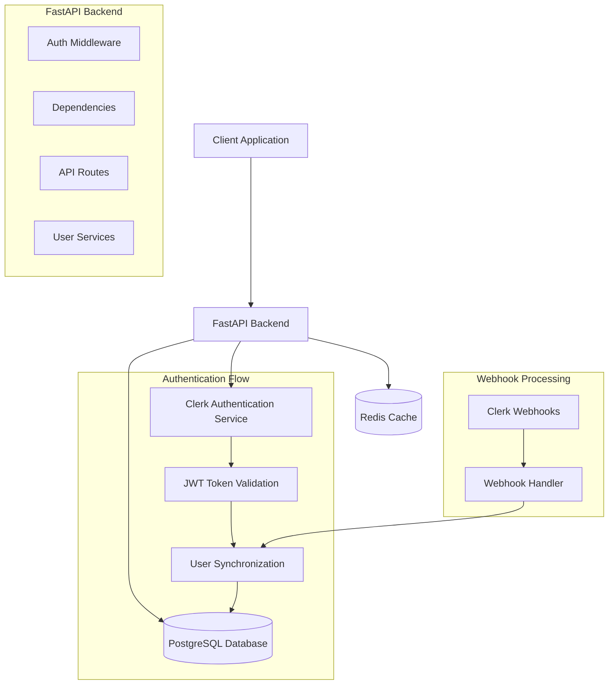

# Design Document

## Overview

This design document outlines the integration of Clerk authentication into the existing veterinary clinic backend API. The integration will replace the current placeholder authentication system with a robust, production-ready solution that leverages Clerk's authentication services while maintaining the existing role-based access control and user management features.

The design focuses on seamless integration with the existing FastAPI application structure, maintaining backward compatibility with current API endpoints while enhancing security and user experience.

## Architecture

### High-Level Architecture



### Authentication Flow

1. **Client Authentication**: Client authenticates with Clerk and receives JWT token
2. **Token Validation**: Backend validates JWT token with Clerk's public keys
3. **User Synchronization**: User data is synchronized between Clerk and local database
4. **Role-Based Access**: Existing RBAC system enforces permissions based on user roles
5. **Session Management**: Redis caches user sessions for performance

## Components and Interfaces

### 1. Clerk Integration Service

**Purpose**: Core service for interacting with Clerk API and handling authentication logic.

**Location**: `app/services/clerk_service.py`

**Key Methods**:
- `verify_jwt_token(token: str) -> ClerkUser`
- `get_user_by_clerk_id(clerk_id: str) -> ClerkUser`
- `sync_user_data(clerk_user: ClerkUser) -> User`
- `handle_webhook_event(event: ClerkWebhookEvent) -> None`

**Dependencies**:
- `httpx` for HTTP requests to Clerk API
- `python-jose` for JWT token verification
- Clerk SDK (to be added to requirements)

### 2. Enhanced Authentication Dependencies

**Purpose**: Update existing authentication dependencies to use Clerk.

**Location**: `app/api/deps.py` (modifications)

**Key Functions**:
- `get_current_user()` - Updated to use Clerk JWT validation
- `verify_clerk_token()` - New function for Clerk-specific token verification
- `sync_clerk_user()` - Ensure user exists in local database

### 3. User Synchronization Service

**Purpose**: Manage synchronization between Clerk users and local user records.

**Location**: `app/services/user_sync_service.py`

**Key Methods**:
- `create_user_from_clerk(clerk_user: ClerkUser) -> User`
- `update_user_from_clerk(user: User, clerk_user: ClerkUser) -> User`
- `handle_user_deletion(clerk_id: str) -> None`

### 4. Webhook Handler

**Purpose**: Process Clerk webhook events for real-time user synchronization.

**Location**: `app/api/webhooks/clerk.py`

**Endpoints**:
- `POST /webhooks/clerk` - Handle all Clerk webhook events

**Event Types**:
- `user.created`
- `user.updated`
- `user.deleted`
- `session.created`
- `session.ended`

### 5. Configuration Updates

**Purpose**: Add Clerk-specific configuration settings.

**Location**: `app/core/config.py` (modifications)

**New Settings**:
- `CLERK_SECRET_KEY`: Backend secret key for API calls
- `CLERK_PUBLISHABLE_KEY`: Frontend publishable key
- `CLERK_WEBHOOK_SECRET`: Secret for webhook signature verification
- `CLERK_JWT_ISSUER`: JWT issuer for token validation

## Data Models

### ClerkUser Data Transfer Object

```python
from pydantic import BaseModel
from typing import Optional, Dict, Any

class ClerkUser(BaseModel):
    id: str  # Clerk user ID
    email_addresses: List[Dict[str, Any]]
    first_name: Optional[str]
    last_name: Optional[str]
    phone_numbers: List[Dict[str, Any]]
    public_metadata: Dict[str, Any]
    private_metadata: Dict[str, Any]
    created_at: int
    updated_at: int
    last_sign_in_at: Optional[int]
```

### User Model Updates

**Location**: `app/models/user.py` (modifications)

**Changes**:
- Ensure `clerk_id` field is properly indexed and unique
- Add methods for Clerk data synchronization
- Update `to_dict()` method to include Clerk-specific fields

### Role Mapping Configuration

**Purpose**: Map Clerk metadata to internal user roles.

**Implementation**: Configuration-based role mapping using public metadata:

```python
CLERK_ROLE_MAPPING = {
    "admin": UserRole.ADMIN,
    "veterinarian": UserRole.VETERINARIAN,
    "receptionist": UserRole.RECEPTIONIST,
    "clinic_manager": UserRole.CLINIC_MANAGER,
    "pet_owner": UserRole.PET_OWNER,
}
```

## Error Handling

### Authentication Errors

1. **Invalid Token**: Return 401 with clear error message
2. **Expired Token**: Return 401 with token refresh guidance
3. **Insufficient Permissions**: Return 403 with required role information
4. **Clerk API Errors**: Log detailed errors, return generic 500 to client

### Webhook Error Handling

1. **Invalid Signature**: Log security event, return 400
2. **Processing Failures**: Implement retry mechanism with exponential backoff
3. **Database Errors**: Ensure webhook idempotency to handle retries

### Fallback Mechanisms

1. **Clerk Service Unavailable**: Cache user data in Redis for temporary access
2. **Database Connection Issues**: Graceful degradation with read-only mode
3. **Webhook Processing Failures**: Queue events for later processing

## Testing Strategy

### Unit Tests

**Location**: `tests/unit/test_clerk_integration.py`

**Test Coverage**:
- JWT token validation
- User synchronization logic
- Role mapping functionality
- Error handling scenarios
- Webhook signature verification

### Integration Tests

**Location**: `tests/integration/test_clerk_auth.py`

**Test Scenarios**:
- End-to-end authentication flow
- User creation and synchronization
- Role-based access control
- Webhook event processing
- API endpoint protection

### Mock Services

**Purpose**: Mock Clerk API responses for testing

**Implementation**:
- Mock JWT token generation
- Simulated webhook events
- Clerk API response fixtures

### Performance Tests

**Focus Areas**:
- JWT token validation performance
- Database synchronization efficiency
- Webhook processing throughput
- Redis caching effectiveness

## Security Considerations

### JWT Token Security

1. **Signature Verification**: Always verify JWT signatures using Clerk's public keys
2. **Token Expiration**: Respect token expiration times and implement refresh logic
3. **Secure Storage**: Never log or store JWT tokens in plain text

### Webhook Security

1. **Signature Verification**: Verify webhook signatures using Clerk webhook secret
2. **HTTPS Only**: Ensure webhook endpoints only accept HTTPS requests
3. **Rate Limiting**: Implement rate limiting for webhook endpoints

### Data Protection

1. **PII Handling**: Minimize storage of personally identifiable information
2. **Encryption**: Encrypt sensitive user data at rest
3. **Access Logging**: Log all authentication and authorization events

### Role Security

1. **Principle of Least Privilege**: Assign minimum required permissions
2. **Role Validation**: Always validate roles from trusted source (Clerk metadata)
3. **Permission Caching**: Cache permissions with appropriate TTL

## Performance Optimizations

### Caching Strategy

1. **User Data Caching**: Cache user profiles in Redis with 15-minute TTL
2. **JWT Validation Caching**: Cache valid tokens for their lifetime
3. **Role Permission Caching**: Cache role permissions with 1-hour TTL

### Database Optimizations

1. **Indexed Fields**: Ensure `clerk_id` and `email` are properly indexed
2. **Connection Pooling**: Use connection pooling for database operations
3. **Batch Operations**: Batch user synchronization operations when possible

### API Performance

1. **Async Operations**: Use async/await for all I/O operations
2. **Request Batching**: Batch Clerk API requests when possible
3. **Circuit Breaker**: Implement circuit breaker pattern for Clerk API calls

## Migration Strategy

### Phase 1: Infrastructure Setup
- Add Clerk dependencies and configuration
- Implement core Clerk service
- Set up webhook endpoints

### Phase 2: Authentication Integration
- Update authentication dependencies
- Implement JWT token validation
- Add user synchronization logic

### Phase 3: Testing and Validation
- Comprehensive testing of all authentication flows
- Performance testing and optimization
- Security audit and penetration testing

### Phase 4: Production Deployment
- Gradual rollout with feature flags
- Monitor authentication metrics
- Fallback to previous system if needed

## Monitoring and Observability

### Metrics to Track

1. **Authentication Success Rate**: Percentage of successful authentications
2. **Token Validation Performance**: Average time for JWT validation
3. **User Synchronization Lag**: Time between Clerk events and local updates
4. **Webhook Processing Rate**: Webhook events processed per minute

### Logging Strategy

1. **Authentication Events**: Log all login/logout events with user context
2. **Error Tracking**: Detailed error logging with correlation IDs
3. **Performance Metrics**: Log slow operations for optimization
4. **Security Events**: Log suspicious authentication attempts

### Alerting

1. **High Error Rates**: Alert on authentication failure spikes
2. **Service Unavailability**: Alert when Clerk API is unreachable
3. **Webhook Failures**: Alert on webhook processing failures
4. **Performance Degradation**: Alert on slow authentication responses