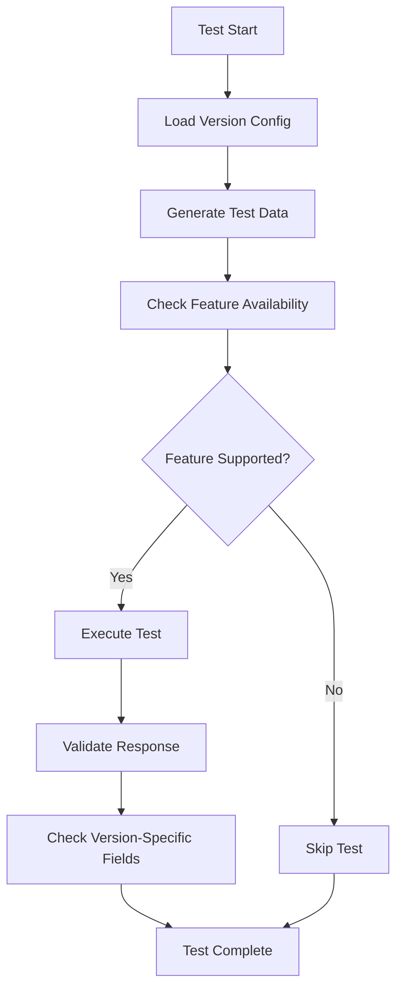

# Design Document

## Overview

The dynamic API testing framework will eliminate code duplication across API versions by implementing a configuration-driven, parameterized testing system. The framework will automatically test endpoints across multiple API versions (v1, v2, and future versions) while handling version-specific features, fields, and behaviors through external configuration and intelligent test data generation.

## Architecture

### Core Components

1. **Version Configuration System**: External YAML/JSON configuration files that define version-specific capabilities, endpoints, and field mappings
2. **Dynamic Test Data Factory**: Intelligent data generation that creates version-appropriate test data based on configuration
3. **Base Test Classes**: Reusable test utilities with version-aware methods for common operations
4. **Parameterized Test Framework**: pytest-based parameterization that automatically runs tests across all configured versions
5. **Feature Detection System**: Runtime feature availability checking to skip tests for unsupported version features

### Configuration-Driven Architecture

The system will use external configuration files to define version differences, eliminating hardcoded version logic in tests:

```yaml
# tests/config/version_config.yaml
versions:
  v1:
    base_url: "/api/v1"
    features:
      health_records: false
      statistics: false
      enhanced_filtering: false
      batch_operations: false
    endpoints:
      pets: "/api/v1/pets"
      users: "/api/v1/users"
      appointments: "/api/v1/appointments"
    schema_fields:
      pet_create: ["name", "species", "breed", "owner_id", "gender", "weight"]
      pet_response: ["id", "name", "species", "breed", "owner_id", "created_at"]
  v2:
    base_url: "/api/v2"
    features:
      health_records: true
      statistics: true
      enhanced_filtering: true
      batch_operations: true
    endpoints:
      pets: "/api/v2/pets"
      users: "/api/v2/users"
      appointments: "/api/v2/appointments"
    schema_fields:
      pet_create: ["name", "species", "breed", "owner_id", "gender", "weight", "temperament", "emergency_contact"]
      pet_response: ["id", "name", "species", "breed", "owner_id", "temperament", "additional_photos", "created_at"]
```

## Components and Interfaces

### 1. Version Configuration Manager

```python
class VersionConfigManager:
    """Manages version-specific configurations and capabilities."""
    
    def __init__(self, config_path: str)
    def get_version_config(self, version: str) -> Dict[str, Any]
    def get_supported_versions(self) -> List[str]
    def get_feature_availability(self, version: str, feature: str) -> bool
    def get_endpoint_url(self, version: str, resource: str) -> str
    def get_schema_fields(self, version: str, schema_type: str) -> List[str]
```

### 2. Dynamic Test Data Factory

```python
class TestDataFactory:
    """Generates version-appropriate test data based on configuration."""
    
    def __init__(self, config_manager: VersionConfigManager)
    def build_pet_data(self, version: str, **overrides) -> Dict[str, Any]
    def build_user_data(self, version: str, **overrides) -> Dict[str, Any]
    def build_appointment_data(self, version: str, **overrides) -> Dict[str, Any]
    def get_expected_response_fields(self, version: str, resource: str) -> List[str]
    def build_update_data(self, version: str, resource: str, **overrides) -> Dict[str, Any]
```

### 3. Base Version Test Class

```python
class BaseVersionTest:
    """Base test class with version-aware utilities."""
    
    def __init__(self)
    def get_endpoint_url(self, version: str, resource: str, resource_id: str = None) -> str
    def should_test_feature(self, version: str, feature: str) -> bool
    async def make_request(self, method: str, url: str, **kwargs) -> httpx.Response
    def validate_response_structure(self, response: Dict, version: str, resource: str)
    def skip_if_feature_unavailable(self, version: str, feature: str)
```

### 4. Parameterized Test Decorators

```python
def version_parametrize(versions: List[str] = None):
    """Decorator to parametrize tests across API versions."""
    
def feature_test(feature: str, versions: List[str] = None):
    """Decorator for feature-specific tests that only run on supporting versions."""
    
def crud_test(resource: str, versions: List[str] = None):
    """Decorator for CRUD operation tests across versions."""
```

### 5. Version-Aware Fixtures

```python
@pytest.fixture(params=["v1", "v2"])
def api_version(request) -> str:
    """Parameterize tests across API versions."""
    
@pytest.fixture
def version_config(api_version) -> Dict[str, Any]:
    """Get configuration for specific API version."""
    
@pytest.fixture
def test_data_factory(version_config) -> TestDataFactory:
    """Factory for generating version-appropriate test data."""
    
@pytest.fixture
def base_url(version_config) -> str:
    """Get base URL for API version."""
```

## Data Models

### Version Configuration Schema

```python
class VersionConfig(BaseModel):
    base_url: str
    features: Dict[str, bool]
    endpoints: Dict[str, str]
    schema_fields: Dict[str, List[str]]
    required_fields: Dict[str, List[str]]
    optional_fields: Dict[str, List[str]]
    default_values: Dict[str, Dict[str, Any]]

class TestConfig(BaseModel):
    versions: Dict[str, VersionConfig]
    global_settings: Dict[str, Any]
    test_data_templates: Dict[str, Dict[str, Any]]
```

### Test Data Templates

```python
class TestDataTemplate(BaseModel):
    base_data: Dict[str, Any]
    version_overrides: Dict[str, Dict[str, Any]]
    field_generators: Dict[str, str]  # Field name -> generator function name
    relationships: Dict[str, str]     # Field dependencies
```

## Error Handling

### Version Compatibility Errors

```python
class VersionCompatibilityError(Exception):
    """Raised when version-specific operations fail."""
    
class FeatureNotSupportedError(Exception):
    """Raised when attempting to test unsupported features."""
    
class ConfigurationError(Exception):
    """Raised when version configuration is invalid."""
```

### Error Handling Strategy

1. **Graceful Feature Skipping**: Tests automatically skip when features aren't supported in specific versions
2. **Configuration Validation**: Validate configuration files at test startup
3. **Clear Error Messages**: Provide detailed error messages indicating version compatibility issues
4. **Fallback Mechanisms**: Use default values when version-specific configurations are missing

## Testing Strategy

### Test Organization Structure

```
tests/
├── config/
│   ├── version_config.yaml
│   └── test_data_templates.yaml
├── dynamic/
│   ├── __init__.py
│   ├── base_test.py
│   ├── config_manager.py
│   ├── data_factory.py
│   └── decorators.py
├── integration/
│   ├── test_pets_dynamic.py
│   ├── test_users_dynamic.py
│   └── test_appointments_dynamic.py
└── unit/
    └── test_dynamic_framework.py
```

### Test Categories

1. **CRUD Tests**: Basic create, read, update, delete operations across all versions
2. **Feature Tests**: Version-specific feature testing (health records, statistics, etc.)
3. **Compatibility Tests**: Cross-version compatibility and consistency validation
4. **Performance Tests**: Version-specific performance characteristics
5. **Error Handling Tests**: Consistent error responses across versions

### Test Execution Flow



### Parameterization Strategy

1. **Version Parameterization**: All tests automatically run against configured versions
2. **Feature Parameterization**: Feature tests run only on versions supporting those features
3. **Data Parameterization**: Test data automatically adapts to version requirements
4. **Endpoint Parameterization**: URLs automatically adjust based on version configuration

## Implementation Phases

### Phase 1: Core Framework
- Version configuration manager
- Base test classes
- Basic parameterization decorators
- Configuration file structure

### Phase 2: Data Factory System
- Dynamic test data generation
- Version-aware field mapping
- Template-based data creation
- Relationship handling

### Phase 3: Advanced Features
- Feature detection and skipping
- Batch operation testing
- Performance comparison across versions
- Error consistency validation

### Phase 4: Integration and Optimization
- Integration with existing test suite
- Performance optimization
- Documentation and examples
- CI/CD integration

## Benefits

### Immediate Benefits
1. **Eliminate Code Duplication**: Single test definitions work across all versions
2. **Consistent Test Coverage**: Ensure all versions receive the same level of testing
3. **Easier Maintenance**: Changes to business logic automatically apply to all version tests
4. **Faster Test Development**: New tests automatically work with all versions

### Long-term Benefits
1. **Scalable Version Management**: Adding new versions requires only configuration changes
2. **Feature Evolution Tracking**: Clear visibility into feature availability across versions
3. **Regression Prevention**: Automatic testing ensures version consistency
4. **Documentation**: Configuration serves as living documentation of version differences

## Migration Strategy

### Existing Test Migration
1. **Identify Common Patterns**: Extract common test logic from existing v1/v2 tests
2. **Create Base Templates**: Convert existing tests to use dynamic framework
3. **Validate Equivalence**: Ensure new dynamic tests provide same coverage as original tests
4. **Gradual Replacement**: Replace existing tests incrementally to minimize risk

### Backward Compatibility
1. **Parallel Execution**: Run both old and new tests during transition period
2. **Result Comparison**: Validate that dynamic tests produce equivalent results
3. **Selective Migration**: Migrate test categories one at a time
4. **Rollback Plan**: Maintain ability to revert to original tests if needed