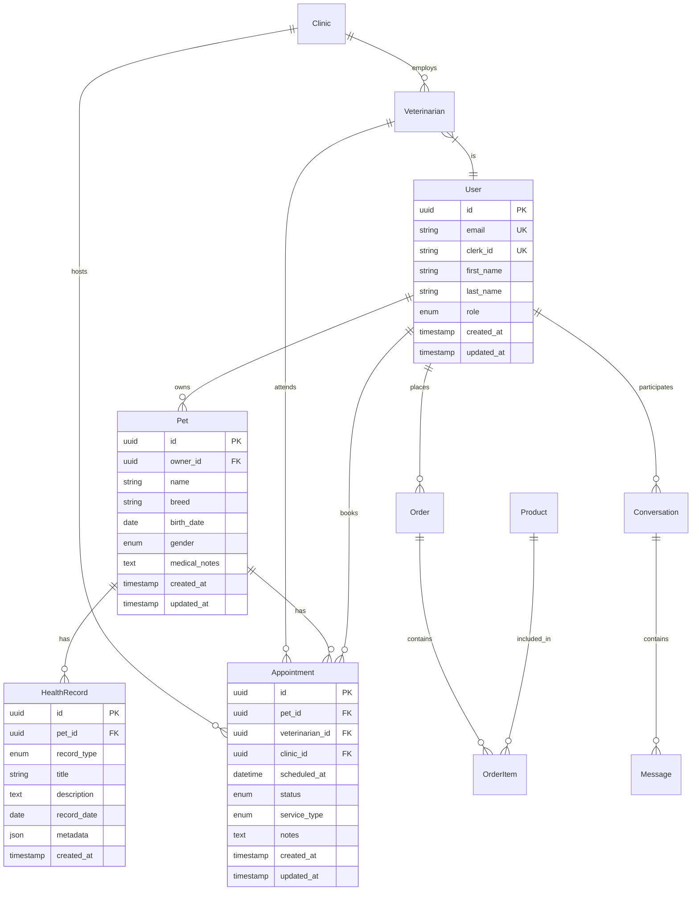

# Design Document

## Overview

The Veterinary Clinic Platform is designed as a comprehensive web and mobile application using a simplified two-repository architecture. The platform consists of a unified backend repository (`vet-clinic-be`) containing all API services, business logic, and data models, and a frontend repository (`vet-clinic-fe`) containing both web and mobile applications. This architecture eliminates the complexity of multiple repositories and package management while maintaining clear separation between frontend and backend concerns.

## Architecture

### Simplified Two-Repository Structure with Clean Backend Architecture

The platform follows a streamlined architecture with two main repositories:

1. **vet-clinic-be**: Unified backend repository with clean layered architecture and API versioning support
2. **vet-clinic-fe**: Frontend repository with web and mobile applications

The backend implements the clean architecture pattern from api-architecture-restructure with version-agnostic business logic, ensuring maintainability, testability, and seamless API evolution. This approach provides easier development, deployment, and maintenance while keeping the codebase organized and scalable.

### Technology Stack

#### Backend Technologies (vet-clinic-be)
- **API Framework**: FastAPI for high-performance REST API development
- **Programming Language**: Python 3.11+ for all backend services
- **Validation**: Pydantic v2 for robust data validation and serialization
- **Authentication**: Clerk integration with Google OAuth for secure user management
- **Database**: PostgreSQL 15+ hosted on Supabase for reliability and scalability
- **Cache Layer**: Redis 7+ for session management and performance optimization
- **ORM**: SQLAlchemy 2.0 with async support for database operations
- **Background Processing**: Celery 5.3+ with Redis as message broker
- **File Storage**: Supabase Storage for images and documents

#### Frontend Technologies (vet-clinic-fe)
- **Web Application**: React 18+ with TypeScript
- **Mobile Application**: React Native with Expo for cross-platform development
- **State Management**: Redux Toolkit with RTK Query for API state management
- **UI Framework**: Tailwind CSS with Headless UI components
- **Build Tools**: Vite for web, Expo CLI for mobile

#### Infrastructure
- **Containerization**: Docker for consistent development environments
- **Backend Hosting**: Railway or DigitalOcean for API services
- **Frontend Hosting**: Vercel for web app, app stores for mobile
- **CI/CD**: GitHub Actions for automated testing and deployment
- **Monitoring**: Sentry for error tracking and performance monitoring

## Components and Interfaces

### Backend Repository Structure (vet-clinic-be) - Clean Architecture with API Versioning

```
vet-clinic-be/
├── app/
│   ├── core/                 # Core utilities and configuration
│   │   ├── config.py        # Application configuration
│   │   ├── database.py      # Database connection and session management
│   │   ├── security.py      # Authentication and authorization utilities
│   │   └── exceptions.py    # Custom exception classes
│   ├── models/              # SQLAlchemy database models
│   │   ├── user.py         # User, roles, and authentication models
│   │   ├── pet.py          # Pet profiles and health records
│   │   ├── appointment.py  # Appointment scheduling models
│   │   ├── clinic.py       # Clinic and veterinarian models
│   │   ├── communication.py # Chat and messaging models
│   │   ├── ecommerce.py    # Product and order models
│   │   └── social.py       # Social feed and interaction models
│   ├── api/                 # API route handlers with versioning
│   │   ├── deps.py         # API dependencies and middleware
│   │   ├── schemas/        # Version-specific schemas
│   │   │   ├── v1/         # V1 request/response models
│   │   │   │   ├── users.py    # V1 user schemas
│   │   │   │   ├── pets.py     # V1 pet schemas
│   │   │   │   ├── appointments.py # V1 appointment schemas
│   │   │   │   ├── clinics.py  # V1 clinic schemas
│   │   │   │   ├── chat.py     # V1 chat schemas
│   │   │   │   ├── ecommerce.py # V1 e-commerce schemas
│   │   │   │   └── social.py   # V1 social schemas
│   │   │   └── v2/         # V2 enhanced schemas (future)
│   │   │       ├── users.py    # V2 enhanced user schemas
│   │   │       ├── pets.py     # V2 enhanced pet schemas
│   │   │       └── [other v2 schemas]
│   │   ├── v1/             # API version 1 routes
│   │   │   ├── users.py    # V1 user endpoints → shared controllers
│   │   │   ├── pets.py     # V1 pet endpoints → shared controllers
│   │   │   ├── appointments.py # V1 appointment endpoints → shared controllers
│   │   │   ├── clinics.py  # V1 clinic endpoints → shared controllers
│   │   │   ├── chat.py     # V1 chat endpoints → shared controllers
│   │   │   ├── ecommerce.py # V1 e-commerce endpoints → shared controllers
│   │   │   ├── social.py   # V1 social endpoints → shared controllers
│   │   │   └── emergency.py # V1 emergency endpoints → shared controllers
│   │   └── v2/             # API version 2 routes (future)
│   │       ├── users.py    # V2 user endpoints → same shared controllers
│   │       ├── pets.py     # V2 pet endpoints → same shared controllers
│   │       └── [other v2 endpoints]
│   ├── users/               # Version-agnostic User resource package
│   │   ├── controller.py   # Shared across ALL API versions
│   │   └── services.py     # Shared across ALL API versions
│   ├── pets/                # Version-agnostic Pet resource package
│   │   ├── controller.py   # Shared across ALL API versions
│   │   └── services.py     # Shared across ALL API versions
│   ├── appointments/        # Version-agnostic Appointment resource package
│   │   ├── controller.py   # Shared across ALL API versions
│   │   └── services.py     # Shared across ALL API versions
│   ├── clinics/             # Version-agnostic Clinic resource package
│   │   ├── controller.py   # Shared across ALL API versions
│   │   └── services.py     # Shared across ALL API versions
│   ├── chat/                # Version-agnostic Communication resource package
│   │   ├── controller.py   # Shared across ALL API versions
│   │   └── services.py     # Shared across ALL API versions
│   ├── app_helpers/         # Common functionality and utilities
│   │   ├── auth_helpers.py # Authentication utilities
│   │   ├── response_helpers.py # Response formatting utilities
│   │   ├── validation_helpers.py # Common validation utilities
│   │   └── dependency_helpers.py # Dependency injection utilities
│   ├── services/            # Legacy business logic services (to be migrated)
│   │   ├── notification_service.py # Email/SMS notifications
│   │   ├── payment_service.py # Payment processing
│   │   ├── location_service.py # Location-based services
│   │   └── ai_service.py   # AI chatbot integration
│   ├── tasks/              # Celery background tasks
│   │   ├── notification_tasks.py # Reminder and notification tasks
│   │   ├── report_tasks.py # Report generation tasks
│   │   └── maintenance_tasks.py # System maintenance tasks
│   └── utils/              # Utility functions
│       ├── email.py        # Email utilities
│       ├── file_storage.py # File upload/download utilities
│       └── validators.py   # Custom validation functions
├── app_tests/              # Test suite (aligned with api-architecture-restructure)
│   ├── unit/               # Unit tests for individual functions
│   │   ├── test_controllers/ # Controller unit tests
│   │   ├── test_services/  # Service unit tests
│   │   ├── test_models/    # Database model tests
│   │   └── test_schemas/   # Pydantic schema tests
│   ├── functional/         # Functional tests for complete workflows
│   │   ├── test_user_workflows/
│   │   ├── test_pet_workflows/
│   │   └── test_appointment_workflows/
│   ├── integration/        # Integration tests for full API flows
│   │   ├── test_v1_endpoints/ # V1 API integration tests
│   │   ├── test_v2_endpoints/ # V2 API integration tests (future)
│   │   ├── test_version_compatibility/ # Cross-version compatibility tests
│   │   ├── test_database/  # Database integration tests
│   │   └── test_tasks/     # Background task tests
│   └── fixtures/           # Test data and fixtures
├── alembic/               # Database migrations
├── docker-compose.yml     # Local development environment
├── Dockerfile            # Container configuration
└── requirements.txt      # Python dependencies
```

### Frontend Repository Structure (vet-clinic-fe)

```
vet-clinic-fe/
├── web/                    # React web application
│   ├── src/
│   │   ├── components/     # Reusable UI components
│   │   ├── pages/         # Page components
│   │   ├── hooks/         # Custom React hooks
│   │   ├── store/         # Redux store configuration
│   │   ├── services/      # API service calls
│   │   └── utils/         # Utility functions
│   ├── public/            # Static assets
│   └── package.json       # Web dependencies
├── mobile/                # React Native mobile app
│   ├── src/
│   │   ├── components/    # Mobile-specific components
│   │   ├── screens/       # Mobile screen components
│   │   ├── navigation/    # Navigation configuration
│   │   ├── store/         # Shared Redux store
│   │   └── services/      # API service calls
│   ├── app.json          # Expo configuration
│   └── package.json      # Mobile dependencies
└── shared/               # Shared utilities between web and mobile
    ├── types/            # TypeScript type definitions
    ├── constants/        # Shared constants
    └── utils/            # Shared utility functions
```

### API Interface Design

The backend exposes RESTful APIs organized by functional domains:

#### Authentication APIs
- `POST /api/v1/auth/register` - User registration
- `POST /api/v1/auth/login` - User authentication
- `POST /api/v1/auth/refresh` - Token refresh
- `GET /api/v1/auth/me` - Current user profile

#### Pet Management APIs
- `GET /api/v1/pets` - List user's pets
- `POST /api/v1/pets` - Register new pet
- `GET /api/v1/pets/{pet_id}` - Get pet details
- `PUT /api/v1/pets/{pet_id}` - Update pet information
- `POST /api/v1/pets/{pet_id}/health-records` - Add health record

#### Appointment APIs
- `GET /api/v1/appointments` - List appointments
- `POST /api/v1/appointments` - Create appointment
- `GET /api/v1/appointments/availability` - Check availability
- `PUT /api/v1/appointments/{appointment_id}` - Update appointment
- `DELETE /api/v1/appointments/{appointment_id}` - Cancel appointment

#### Communication APIs
- `GET /api/v1/chat/conversations` - List conversations
- `POST /api/v1/chat/conversations` - Start new conversation
- `GET /api/v1/chat/conversations/{conversation_id}/messages` - Get messages
- `POST /api/v1/chat/conversations/{conversation_id}/messages` - Send message

## Data Models

### Core Entity Relationships



### Database Schema Design

The database schema is designed for optimal performance and data integrity:

#### User Management
- **Users table**: Core user information with Clerk integration
- **Roles table**: Role-based access control definitions
- **UserRoles table**: Many-to-many relationship for user roles

#### Pet Health Management
- **Pets table**: Pet profiles and basic information
- **HealthRecords table**: Medical history, vaccinations, medications
- **Reminders table**: Automated notification scheduling

#### Appointment System
- **Appointments table**: Appointment scheduling and status
- **Services table**: Available veterinary services
- **Availability table**: Veterinarian availability schedules

#### Communication System
- **Conversations table**: Chat conversation metadata
- **Messages table**: Individual chat messages
- **Notifications table**: System notifications and reminders

## Error Handling

### API Error Response Format

All API errors follow a consistent format:

```json
{
  "error": {
    "code": "VALIDATION_ERROR",
    "message": "Invalid input data",
    "details": {
      "field": "email",
      "issue": "Invalid email format"
    },
    "timestamp": "2024-01-15T10:30:00Z"
  }
}
```

### Error Categories

1. **Authentication Errors** (401): Invalid or expired tokens
2. **Authorization Errors** (403): Insufficient permissions
3. **Validation Errors** (422): Invalid input data
4. **Not Found Errors** (404): Resource not found
5. **Server Errors** (500): Internal system errors

### Error Handling Strategy

- **Client-side**: Graceful error display with user-friendly messages
- **Server-side**: Comprehensive logging with error tracking via Sentry
- **Database**: Transaction rollback on errors with proper cleanup
- **Background Tasks**: Retry mechanisms with exponential backoff

## Testing Strategy

### Backend Testing (vet-clinic-be)

#### Unit Tests
- **Models**: Test SQLAlchemy model validation and relationships
- **Services**: Test business logic with mocked dependencies
- **Schemas**: Test Pydantic validation and serialization
- **Utilities**: Test helper functions and utilities

#### Integration Tests
- **API Endpoints**: Test complete request/response cycles
- **Database**: Test database operations and migrations
- **Authentication**: Test Clerk integration and JWT handling
- **Background Tasks**: Test Celery task execution

#### Test Structure
```
tests/
├── unit/
│   ├── test_models/
│   ├── test_services/
│   └── test_schemas/
├── integration/
│   ├── test_api/
│   ├── test_database/
│   └── test_tasks/
└── fixtures/
    ├── test_data.py
    └── conftest.py
```

### Frontend Testing (vet-clinic-fe)

#### Component Tests
- **React Components**: Test component rendering and interactions
- **Redux Store**: Test state management and actions
- **API Services**: Test API integration with mocked responses
- **Navigation**: Test routing and navigation flows

#### End-to-End Tests
- **User Flows**: Test complete user journeys
- **Cross-Platform**: Test web and mobile functionality
- **Integration**: Test frontend-backend integration

### Testing Tools and Frameworks

- **Backend**: pytest, pytest-asyncio, httpx for API testing
- **Frontend**: Jest, React Testing Library, Cypress for E2E
- **Mobile**: Jest, React Native Testing Library, Detox
- **API Testing**: Postman collections for manual testing
- **Performance**: Load testing with Locust

### Continuous Integration

GitHub Actions workflows for:
- **Backend**: Run tests, linting, security scans
- **Frontend**: Run tests, build verification, accessibility checks
- **Database**: Migration testing and rollback verification
- **Deployment**: Automated deployment to staging and production

This design provides a solid foundation for building a scalable, maintainable veterinary clinic platform while keeping the architecture simple and focused on the core requirements.