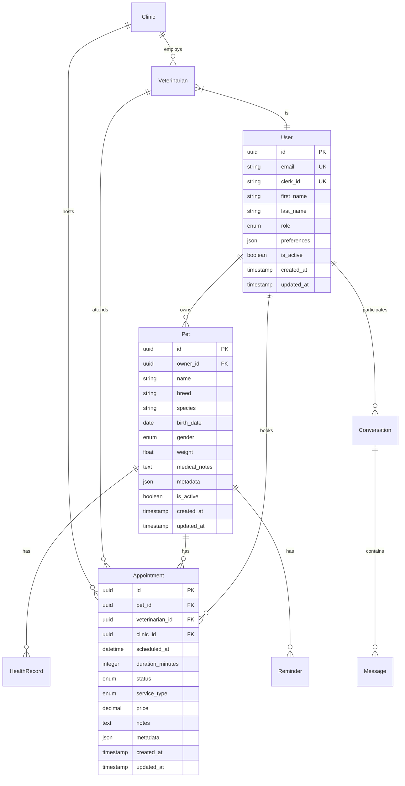

# Database Architecture

This document describes the database design and schema for the vet-clinic-be project.

## Database Technology

- **Database**: PostgreSQL 15+
- **ORM**: SQLAlchemy 2.0 with async support
- **Migrations**: Alembic
- **Connection Pool**: AsyncPG with connection pooling

## Core Entity Relationships



## Database Models

### User Management
- **User**: Core user profiles with Clerk integration
- **UserSession**: Session tracking and management
- **UserRole**: Role-based access control (RBAC)

### Pet Management
- **Pet**: Comprehensive pet profiles
- **HealthRecord**: Medical history and records
- **Reminder**: Automated care reminders

### Clinic Management
- **Clinic**: Clinic profiles with location data
- **Veterinarian**: Veterinarian profiles and specialties
- **ClinicOperatingHours**: Business hours management
- **VeterinarianAvailability**: Schedule management

### Appointment System
- **Appointment**: Appointment scheduling and tracking
- **AppointmentSlot**: Available time slots

### Communication
- **Conversation**: Chat conversations
- **Message**: Individual messages
- **MessageReaction**: Message reactions and interactions
- **ChatBot**: AI chatbot configurations

### Reviews and Ratings
- **ClinicReview**: Clinic reviews and ratings
- **VeterinarianReview**: Veterinarian reviews and ratings

## Indexing Strategy

### Primary Indexes
- All primary keys use UUID with B-tree indexes
- Foreign keys have B-tree indexes for join optimization

### Search Indexes
- **Full-text search**: GIN indexes on searchable text fields
- **Location search**: GiST indexes for geographic queries
- **Date ranges**: B-tree indexes on timestamp fields

### Performance Indexes
```sql
-- User lookup by Clerk ID
CREATE INDEX idx_users_clerk_id ON users(clerk_id);

-- Pet search by owner
CREATE INDEX idx_pets_owner_id ON pets(owner_id);

-- Appointment scheduling queries
CREATE INDEX idx_appointments_scheduled_at ON appointments(scheduled_at);
CREATE INDEX idx_appointments_status ON appointments(status);

-- Location-based clinic search
CREATE INDEX idx_clinics_location ON clinics USING GIST(point(longitude, latitude));

-- Message conversation queries
CREATE INDEX idx_messages_conversation_created ON messages(conversation_id, created_at);
```

## Data Types and Constraints

### UUID Primary Keys
All entities use UUID primary keys for:
- Global uniqueness
- Security (non-sequential)
- Distributed system compatibility

### Enums
Strongly typed enums for:
- User roles
- Pet characteristics
- Appointment statuses
- Message types

### JSON Fields
JSON columns for flexible data:
- User preferences
- Pet metadata
- Appointment service details
- Message attachments

### Timestamps
All entities include:
- `created_at`: Record creation time
- `updated_at`: Last modification time (auto-updated)

## Database Migrations

### Migration Management
```bash
# Create new migration
alembic revision --autogenerate -m "Description"

# Apply migrations
alembic upgrade head

# Rollback migration
alembic downgrade -1
```

### Migration Best Practices
1. **Always review** auto-generated migrations
2. **Test migrations** on development data
3. **Backup production** before applying
4. **Use transactions** for complex changes
5. **Document breaking changes**

## Performance Considerations

### Connection Pooling
```python
# Async connection pool configuration
engine = create_async_engine(
    DATABASE_URL,
    pool_size=20,
    max_overflow=30,
    pool_timeout=30,
    pool_recycle=3600
)
```

### Query Optimization
- Use `selectin` loading for relationships
- Implement pagination for large datasets
- Use database-level constraints
- Monitor slow queries with logging

### Partitioning Strategy
For high-volume tables:
- **Appointments**: Partition by date range
- **Messages**: Partition by conversation or date
- **HealthRecords**: Partition by pet or date

## Backup and Recovery

### Backup Strategy
- **Daily**: Full database backup
- **Hourly**: Incremental backups
- **Real-time**: Write-ahead log (WAL) archiving

### Recovery Procedures
1. Point-in-time recovery capability
2. Cross-region backup replication
3. Automated backup verification
4. Disaster recovery testing

## Security

### Data Protection
- **Encryption at rest**: Database-level encryption
- **Encryption in transit**: SSL/TLS connections
- **Access control**: Role-based database permissions
- **Audit logging**: Track sensitive data access

### Compliance
- **HIPAA**: Health information protection
- **GDPR**: Personal data protection
- **Data retention**: Automated cleanup policies